# 2.2-task-planner-api-part-2
In this lab you will use your knowledge in Javascript language to complete the Task Planner API. In the first lab you deployed the User API as a containerized microservice. For the Task API you will use serveless technology.

### Prerequisites
- Install NodeJS and NPM  (https://nodejs.org/es/download/)
- It may be helpful to install an IDE (Eclipse, IntelliJ, VS Code, ...)

### Part 1: Add Task API
1. Create a new empty repository for your project and clone it locally.
2. Run the nodejs init command to create your *package.json* file. Set the requested fields.

    ```bash
    npm init
    ```
    *Important:* Ensure you let the **main** field empty.

3. Create a subfolder named add-task and create a file named `index.js`. The file should export a function implementing the logic for adding a task. It gets two arguments: a `context` object where you can send the response of your function and the `req` object where the payload of the request is received. In the `req.body` object you will get the body of your request with the fields of a task to be created.

    ```javascript
    module.exports = async function (context, req) {
        context.log('Adding a task to the planner');

        const task = req.body;
        // Implement the response
        const responseMessage = { response: "Implement me!"};

        context.res = {
            status: 201,
            body: responseMessage
        };
    }
    ```

    The response should contain the fields of the task and a unique identifier for the created task.

4. Given you will deploy your function as a REST endpoint to Azure, you need a file named `function.json` in the add-task folder with the following contents:

    ```javascript
    {
    "bindings": [
        {
        "authLevel": "function",
        "type": "httpTrigger",
        "direction": "in",
        "name": "req",
        "methods": [
            "post"
        ]
        },
        {
        "type": "http",
        "direction": "out",
        "name": "res"
        }
    ]
    }
    ```

5. Install the Azure Functions Core Tools:

    ```bash
    npm install -g azure-functions-core-tools@3 --unsafe-perm true
    ```

6. If you are interested in testing your function locally, create a file at the root folder of your project named `local.settings.json` with the following contents:

    ```javascript
    {
    "IsEncrypted": false,
    "Values": {
        "FUNCTIONS_WORKER_RUNTIME": "node",
        "AzureWebJobsStorage": ""
    }
    }
    ```
    Then, run the following command to get a local endpoint for testing your API.

    ```bash
    func start
    ```
    You should see an output similar to this:

    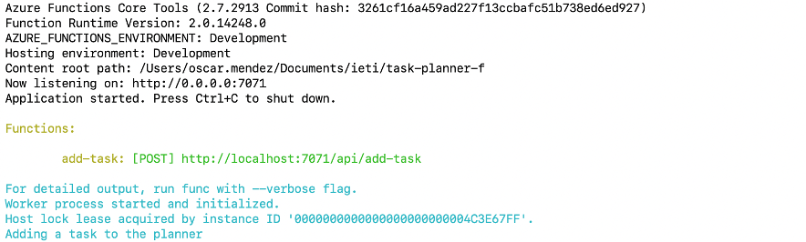

    Use the URL in the output to test your API.

7. Log in to the Azure web console and create an Azure Function.
- Click on the create resource button

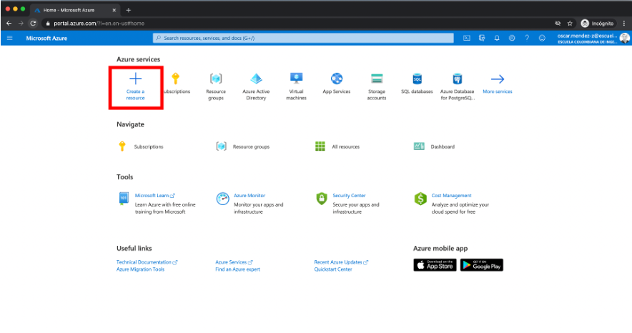

- Search for the *Function App* service and select it.

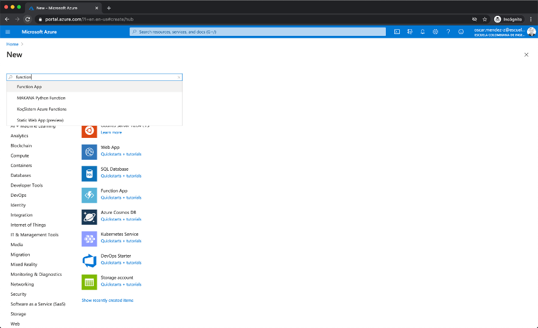

- Click on create.

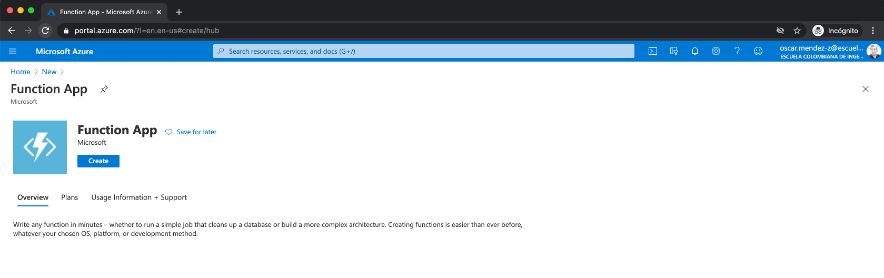

- Fill the basic fields. Choose a name for your API (Function App name). It will be used later for replacing the placeholder `<my-api-name>`. Select the NodeJS runtime.

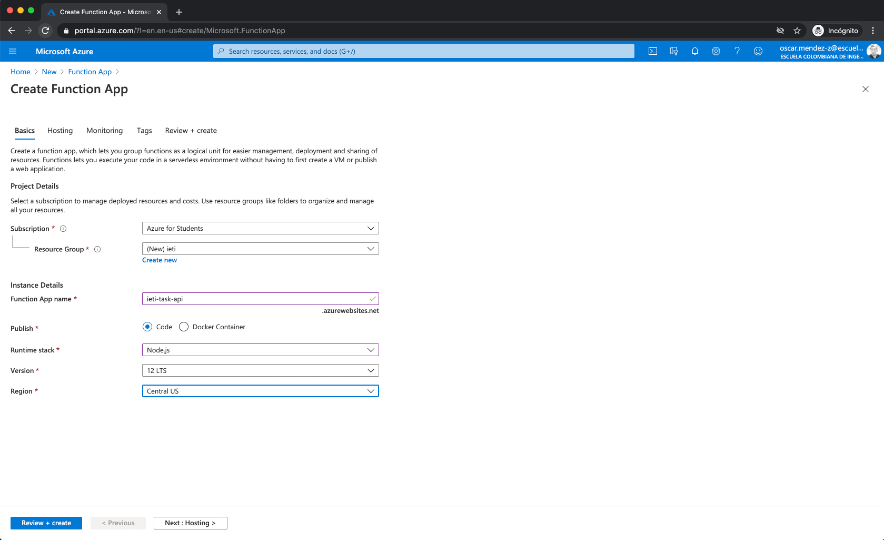

- Click Next and select Linux OS in the Hosting tab.

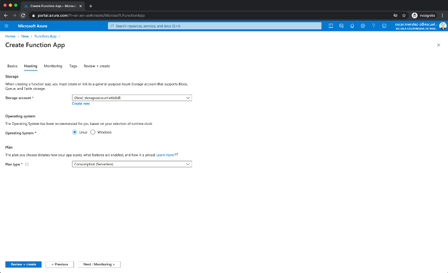

- Click Next and select *No* for Application Insights monitoring.

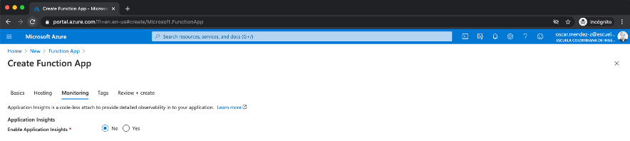

- Click on Review and Create and finally click on Create.

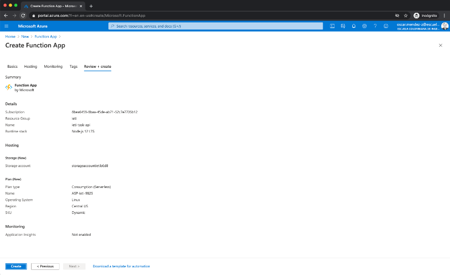

- Wait a few minutes until the resources are provisioned. Then, click on *Go to resource*.

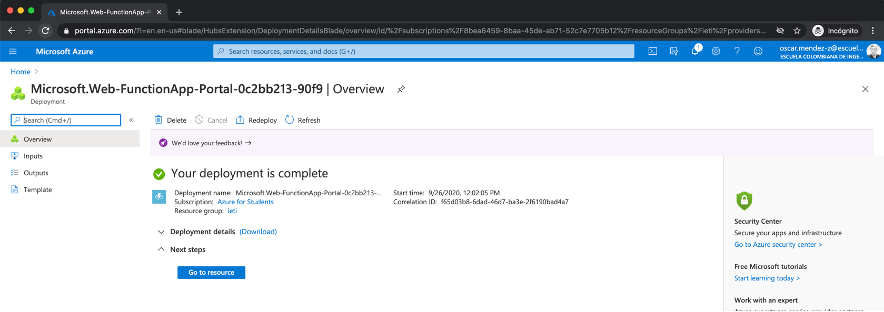

You are redirected to the home page of your function:

 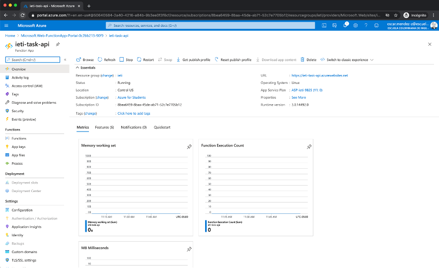  

 - Click on the *Functions* option on the left panel. There are no functions deployed yet.

 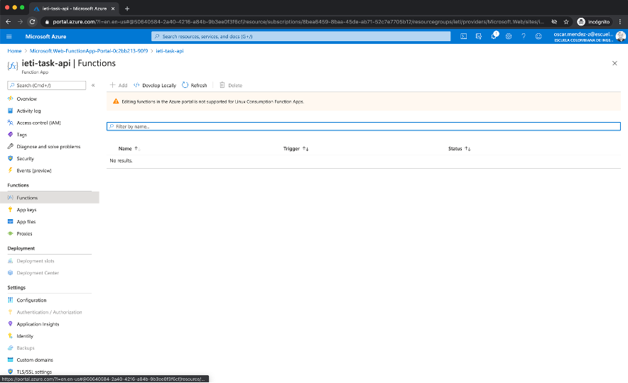   


8. Go back to your command prompt and execute the following. Replace the `<my-api-name>` placeholder by the name of your API.

    ```bash
        func azure functionapp publish <my-api-name> 
    ```

    You may be requested to log in to your Azure account.

    You should see the an output similar to this:

  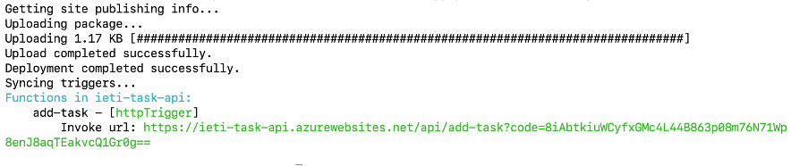   

9. In the web console, click on the *Refresh* button. You should see the function deployed.

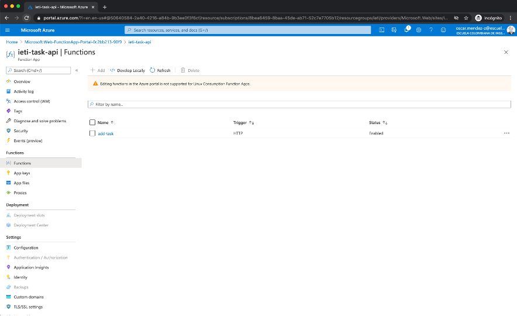 

10. Click on the add-task link and use the *Get Function Url* to get the URL of your Azure function. Test it!
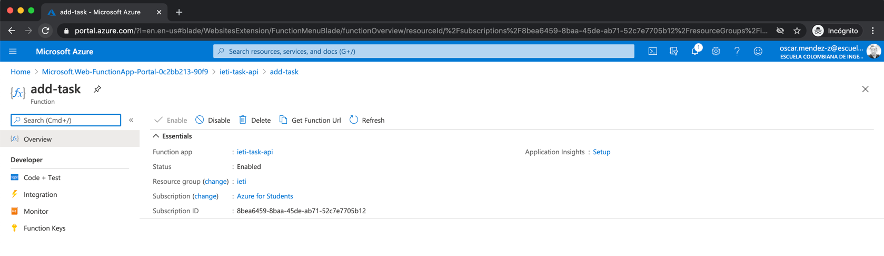 

__Note:__ If you are using AWS instead of Azure, take a look into the following resource where something similar is achieved using serverless framework:

https://www.serverless.com/blog/node-rest-api-with-serverless-lambda-and-dynamodb

### Part 2: List Tasks API

1. Create a subfolder named list-tasks and implement the function for returning the list of tasks following the same steps of the part 1. It should use the HTTP **Get** method and return a **200** status.

2. Deploy the project again to Azure.

### Part 3: Consume your Task API

1. Implement the frontend consumption for your endpoints.